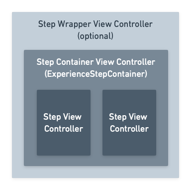
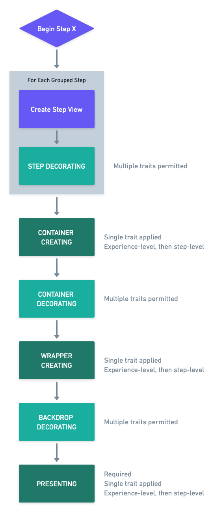

# Understanding the Experience Trait System

Experiences displayed by the Appcues iOS SDK are customizable and extensible via a flexible system of Experience Traits.

## Overview

An ``AppcuesExperienceTrait`` modifies the how an entire experience, or a particular step in an experience is displayed. A trait of a specific _type_ has _capabilities_ that modify the way an experience is displayed to the user. Furthermore a trait can be applied at multiple _levels_ which determines which parts of the experience are impacted by the trait instance.

Traits operate on the following view controller hierarchy, providing the ability to create and modify the controllers where appropriate:



## Trait Types

Every trait has a ``AppcuesExperienceTrait/type`` property that must be a unique name identifying the trait. Best practice is to prefix the `type` with your organization name, resulting in the format `@org/name` (e.g. `@appcues/modal`).

Attempting to register a trait for a type that exists already will crash in debug builds and fail silently otherwise.

## Trait Capabilities

An experience trait must adopt at least one of the following capabilities to have any effect, and may adopt more than one for more complex functionality.

### Step Decorating

An ``AppcuesStepDecoratingTrait`` modifies the `UIViewController` that encapsulates the contents of a specific step in the experience.

### Container Creating

An ``AppcuesContainerCreatingTrait`` is responsible for creating the `UIViewController` (specifically a ``AppcuesExperienceContainerViewController``) that holds the experience step(s) being presented. The returned controller must call the ``AppcuesExperienceContainerEventHandler`` methods at the appropriate times.

> Only a single ``AppcuesContainerCreatingTrait`` will be applied in the process of displaying an experience step even if multiple are defined.

### Container Decorating

An ``AppcuesContainerDecoratingTrait`` modifies the container view controller created by an ``AppcuesContainerCreatingTrait``.

### Backdrop Decorating

An ``AppcuesBackdropDecoratingTrait`` modifies the backdrop `UIView` that may be included in the presented experience.

>  Not all experiences will include a backdrop, and an ``AppcuesBackdropDecoratingTrait`` will not be invoked if the experience does not include a backdrop.

### Wrapper Creating

An ``AppcuesWrapperCreatingTrait`` creates a `UIViewController` that wraps the ``AppcuesExperienceContainerViewController``. This trait is also responsible for adding the backdrop view to the appropriate (if any) place.

> Only a single ``AppcuesWrapperCreatingTrait`` will be applied in the process of displaying an experience step even if multiple are defined.

### Presenting

An ``AppcuesPresentingTrait`` is responsible for providing the ability to show and hide the experience.

> Only a single ``AppcuesPresentingTrait`` will be applied in the process of displaying an experience step even if multiple are defined.

## Trait Levels

The Appcues mobile experience data model allows for traits to be specified at the experience level, at the step-group level, or at the step level. 

- Experience-level traits modify the entire experience and are applied when any step of the experience is being displayed.
- Group-level traits apply when any of child steps of the group is being displayed. 
- Step-level `Decorating` traits are scoped to be applied only when the specific step is being displayed. A `Creating` or `Presenting` trait set at the step-level will be ignored because applying them would leak beyond the specific step an impact the display of any sibling steps.

In practice this distinction looks like this in the experience data model:

```json
{
    ...
    "traits": [
        // Experience-level traits
        // Presenting and Creating traits propagated to each group
        // Decorating traits are propagated to every child step
    ],
    "steps": [
        {
            ...
            "traits": [
                // Group-level traits
                // Presenting and Creating traits are applied, taking precedence over traits of the same type at the experience-level
                // Decorating traits are propagated to every child step in the group
            ],
            "children": [
                {
                    ...
                    "content": { ... },
                    "traits": [
                        // Step-level traits for the first step
                        // Presenting and Creating traits are ignored
                        // Decorating traits only
                    ]
                }
            ]
        },
        {
            ...
            "content": { ... },
            "traits": [
                // Step-level traits for the second step
                // Presenting and Creating traits are ignored
                // Decorating traits only
            ]
        }
    ]
}
```

Only a single instance of each trait type may be included in the `traits` array at any given level. If multiple traits with the same `type` are included in the same array, the experience is invalid, an error will be logged, and the experience will not display. The most specific instance of a trait type will take precedence over a trait of the same type specified at a higher level.

A trait is made aware of the level at which it is being applied by the ``AppcuesExperiencePluginConfiguration/Level-swift.enum`` passed into ``AppcuesExperienceTrait/init(configuration:)``. A trait may choose to alter its behavior depending on the `level` at which it is applied.

For example, a trait might simultaneously conform to ``AppcuesStepDecoratingTrait`` and ``AppcuesContainerDecoratingTrait`` and the choose to apply it's decoration in only one of those contexts:

```swift
let level: AppcuesExperiencePluginConfiguration.Level

required init?(configuration: AppcuesExperiencePluginConfiguration) {
    self.level = config.level
}

// AppcuesStepDecoratingTrait
func decorate(stepController viewController: UIViewController) throws {
    guard level == .step else { return }

    // do something when the trait was applied a step level
}

// AppcuesContainerDecoratingTrait
func decorate(containerController: ExperienceContainerViewController) throws {
    guard level == .group else { return }

    // do something when the trait was applied a group level
}
```

## Trait Application Sequence

Trait capabilities are applied in a defined sequence, and a trait with multiple capabilities will have its capabilities applied piecewise.



> A trait with multiple capabilities may, in certain circumstances, not have all its capabilities applied. An ``AppcuesBackdropDecoratingTrait`` will not be applied if no ``AppcuesWrapperCreatingTrait`` is present. Additionally, single trait capabilities (i.e. ``AppcuesContainerCreatingTrait``, ``AppcuesWrapperCreatingTrait``, and ``AppcuesPresentingTrait``) will ignore all but the first trait model in the most specific context that provides the capability. Additionally, ``AppcuesContainerCreatingTrait``, ``AppcuesWrapperCreatingTrait``, and ``AppcuesPresentingTrait`` capabilities provided at the step level within a group are ignored.

## Sharing Data Across Traits

There may be cases where values or data from one trait type are required for the successful rendering of another trait type. Similarly, there may be cases where you wish to coordinate a transition between traits of the same type applied at the step-level. In both these cases, the ``AppcuesTraitMetadataDelegate`` provides a mechanism to manage data across trait instances.

Every ``AppcuesExperienceTrait`` includes a ``AppcuesExperienceTrait/metadataDelegate`` that supports three key features:

1. Set a metadata value for reading by other traits.
2. Get a metadata value via a handler block.
3. Publish a new metadata value on demand, notifying all other traits that have a registered handler.

For example, there is a trait `@appcues/step-transition-animation` that sets two metadata values `animationDuration` and `animationEasing` using ``AppcuesTraitMetadataDelegate/set(_:)``. Other traits can read these values using ``AppcuesTraitMetadataDelegate/registerHandler(for:animating:handler:)`` to set consistent animations across multiple traits. 

## Error Handling

There may be cases where a trait is unable to perform its intended capability. If this happens, it's preferred that a non-essential trait fail silently so that the experience can still be displayed to the user. However if a trait implementation is essential, it may throw a ``AppcuesTraitError`` that will prevent the experience from being displayed and log an error with the Appcues platform.

For example, an ``AppcuesContainerCreatingTrait`` that is unable to create a proper container instance may throw a ``AppcuesTraitError`` with a ``AppcuesTraitError/description`` explaining the nature of the error. The description message will be visible in Appcues Studio.

## Topics

### Capabilities

- ``AppcuesStepDecoratingTrait``
- ``AppcuesContainerCreatingTrait``
- ``AppcuesContainerDecoratingTrait``
- ``AppcuesBackdropDecoratingTrait``
- ``AppcuesWrapperCreatingTrait``
- ``AppcuesPresentingTrait``

### Containers

- ``AppcuesExperienceContainer``
- ``AppcuesExperienceContainerViewController``
- ``AppcuesExperienceContainerEventHandler``
- ``AppcuesExperiencePageMonitor``

### Error Handing

- ``AppcuesTraitError``
